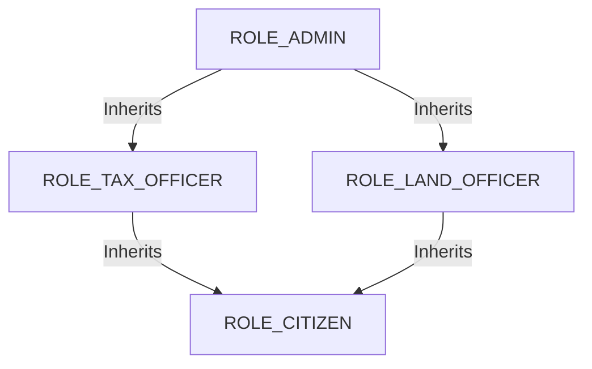
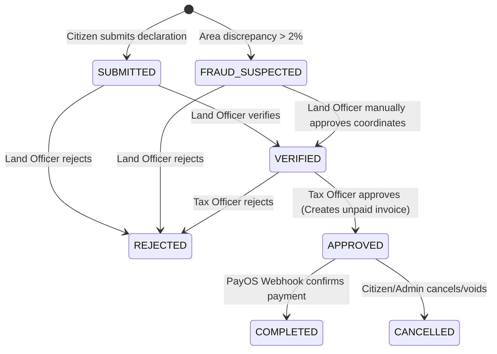
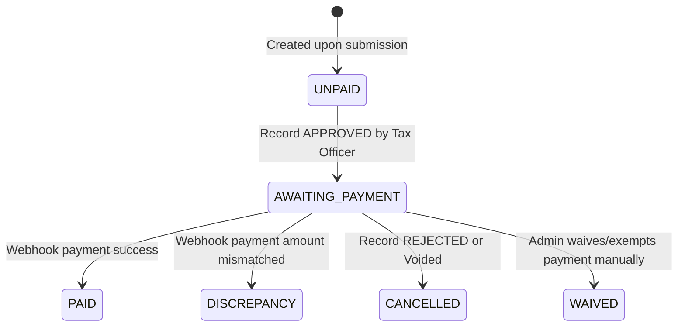
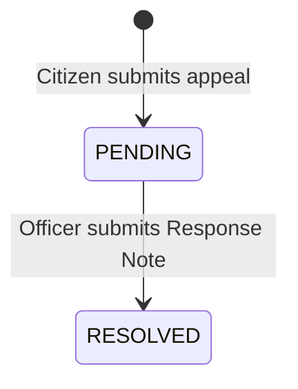

# Frontend-Relevant Business Rules & Flowcharts

This document captures the backend business logic, validation rules, state machines, and formulas required for frontend interface logic, error handling, and state visualizers.

---

## 1. Role-Based Access Control (RBAC) & Active Session Roles

The application implements a multi-role hierarchy mapping privileges from highest to lowest. A user can possess multiple roles simultaneously but must choose **one** active role for their current session.

### Session Role Switching Flow
1. Upon logging in via VNeID QR, the user receives their allowed roles (`roles`) and their default `activeRole` (e.g. `ROLE_CITIZEN`).
2. The user can switch roles via `POST /api/auth/switch-role`. This responds with a new JWT where the active role is encoded in the subject.
3. The frontend must parse this active role to hide/show corresponding dashboards and navigation tabs.

---

## 2. State Machine Transitions

### A. Tax Declaration / Record Status Flow (`RecordEntity.currentStatus`)
A record tracks the lifecycles of tax declarations from submission to final validation, approval, and completion.

* **SUBMITTED**: Initial state of declaration.
* **FRAUD_SUSPECTED**: Triggered if the declared area size differs from the registry file by more than 2%.
* **VERIFIED**: Checked by a `LAND_OFFICER` who ensures the land coordinates, map sheet numbers, and category codes exist.
* **APPROVED**: Checked by a `TAX_OFFICER` who reviews the estimated tax calculation, applying potential exemptions. This triggers generation of a billing invoice.
* **REJECTED**: Rejected by officers. The workflow ends and a reason is appended.
* **COMPLETED**: Paid successfully. No further status changes allowed.

---

### B. Tax Payment Status Flow (`TaxPaymentEntity.paymentStatus`)
Tracks invoice states and bank/PayOS payment transitions.

* **UNPAID**: Created dynamically during record submission (draft invoice).
* **AWAITING_PAYMENT**: Invoice is locked, a digital checkout QR code and payment link can now be generated for the citizen.
* **PAID**: Confirmed by PayOS or manual bank transfer.
* **DISCREPANCY**: Set automatically during banking audit reconciliation if the amount transferred does not match the invoice amount.
* **CANCELLED**: Set when the corresponding declaration is rejected.
* **WAIVED**: Manually set by Admins/Tax Officers for special exemption circumstances.

---

### C. Complaint Status Flow (`ComplaintEntity.status`)
Tracks citizen appeals regarding tax amount disputes or parcel records.

---

## 3. Input Validation & Verification Rules

The frontend must replicate these validation rules in its forms to maximize success rates and optimize UX.

### 1. Land Parcel Ownership Constraint
* **Rule**: A citizen can **only** submit tax declarations for land parcels they officially own.
* **Backend Check**: Queries the `land_owners` join table to match the current citizen ID with the parcel ID.
* **Failure Code**: Throws a `RuntimeException` with: `"You do not have permission to submit a declaration for this land parcel."`
* **FE Implementation**: Filter search menus/dropdowns to only display the citizen's owned parcels returned by `GET /api/land-parcels/my-parcels`.

### 2. Fraud Check Threshold (2% Rule)
* **Rule**: If the area declared by the citizen deviates by **more than 2%** from the registry's official record, it is marked as potentially fraudulent.
* **Backend Logic**:
  $$| \text{Actual Area} - \text{Declared Area} | > \text{Actual Area} \times 0.02$$
* **Action**: Sets the record status to `FRAUD_SUSPECTED` and writes a warning message to the declaration notes.
* **FE Implementation**: Warn the user inline if they enter an area size differing by more than 2% from the parcel's size.

---

## 4. Tax Calculation Formulas

> [!IMPORTANT]
> The backend supports **two** separate tax calculation formulas. Use the correct formula depending on the feature module:

### Formula A: Public Estimator Widget (Homepage)
Used on the public widget to give visitors a quick estimate of their prospective tax.
* **Backend Endpoint**: `POST /api/taxes/calculate`
* **Formula**:
  $$\text{Estimated Tax} = \text{Declared Area} \times \text{Unit Price} \times \text{Tax Rate}$$
* **Parameters**:
  - `Declared Area`: Entered by user.
  - `Unit Price`: Pulled from `land_prices` lookup.
  - `Tax Rate`: Hardcoded as `0.0003` ($0.03\%$).

### Formula B: Official Bill Calculation (Invoice Generation)
Calculates the final tax due when a declaration is verified and approved.
* **Backend Location**: `TaxCalculationService.java`
* **Formula**:
  $$\text{Tax Due} = \text{Actual Area} \times \text{Unit Price} \times \left(1 - \frac{\text{Discount Rate}}{100}\right)$$
* **Parameters**:
  - `Actual Area`: Size in the official database parcel record.
  - `Unit Price`: Found in the active price book matching location (`areaId`) and category (`landTypeId`).
  - `Discount Rate`: Exemption percentage from `TaxExemptSubjectEntity` (defaults to `0` if the citizen does not qualify).

---

## 5. Webhook Integration & Reconciliation Rules

### PayOS Webhook
* **Webhook Endpoint**: `POST /api/payments/webhook`
* **Process Flow**:
  1. PayOS posts transaction data to `/webhook` after the user scans the VietQR and completes payment.
  2. The webhook reads the JSON payload wrapper.
  3. Checks `code == "00"` (means success).
  4. Reads the nested `data.orderCode` field.
  5. The backend locates the payment record matching `orderCode` and changes the status to `PAID`.
  6. Automatically updates the parent Record status to `COMPLETED`.

### Bank Reconciliation (Reconcile Logs)
For manual direct bank transfers:
- If a bank transfer has a mismatched amount, the log status is updated to `DISCREPANCY` under reconciliation logs.
- The Admin/Officer must manually adjust the invoice to resolved using `PUT /api/payments/bills/{id}/adjust`.
